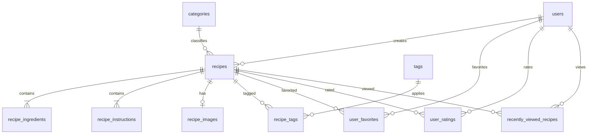

# Technical Design

**Document version:** 1.0
**Status:** Accepted
**Last updated:** 2026-08-22
**Current product scope:** Phase 1 — Core Cookbook

This document defines how the approved Phase 1 requirements in [`PRD.md`](./PRD.md) will be implemented. It deliberately excludes later product phases and MCP implementation.

## 1. Goals and constraints

Phase 1 must provide a private, mobile-friendly household cookbook with:

- shared recipe, category, tag, instruction, ingredient, note, and photo data;
- per-user favorites, ratings, and recently viewed history;
- exact, deterministic serving scaling that never mutates the saved recipe;
- recoverable recipe deletion;
- a consumer-oriented browsing and cooking experience;
- business rules that can later be reused outside the React frontend.

The implementation follows the Pior Labs paved road:

- TypeScript, React, Vite, and `@pior-labs/design-system`;
- Hono API;
- PostgreSQL and Drizzle;
- `service-auth` OAuth/OIDC with application-local sessions;
- pnpm workspaces, Docker Compose, and GitHub Actions;
- platform-managed Caddy routing and TLS.

Phase 1 does not implement meal planning, grocery lists, recipe importing, Recipe Roulette, nutrition, pantry tracking, public sharing, or MCP.

## 2. Established foundation

The following are already implemented and are not redesigned here:

- `@cookbook/web` and `@cookbook/api` workspace packages;
- responsive Cookbook application and login shells;
- Hono liveness and PostgreSQL readiness endpoints;
- `DATABASE_URL` locally and `DATABASE_URL_FILE` in production;
- Drizzle migrations for application-local auth tables;
- the `cookbook` OAuth client registered in `service-auth` source, with its development callback requiring alignment to shared `localhost:5173`;
- authorization-code flow with PKCE, issuer validation, an HTTP-only Cookbook session, and deny-by-default `/api/*` authorization;
- static-only Caddy in the web container, with production API routing owned by platform Caddy.

Authentication is recorded in [ADR 0001](./DECISIONS/0001-central-sso-and-local-sessions.md).

## 3. Package and code boundaries

Add a pure `@cookbook/domain` workspace package. It owns:

- API input and output schemas shared by trusted application packages;
- recipe and preference domain types;
- ingredient fraction parsing, reduction, scaling, and display formatting;
- unit definitions and labels;
- normalization and validation rules that do not depend on HTTP, React, or PostgreSQL.

The domain package must not import Hono, Drizzle, React, filesystem code, or environment configuration.

The API owns:

- authentication middleware and authorization;
- repositories and Drizzle queries;
- transactions and orchestration services;
- image decoding, transformation, storage, and delivery;
- mapping between database records and domain/API representations.

The web package owns presentation, interaction state, routing, accessibility, and client-side form feedback. It must not become the only implementation of a business rule. The API remains authoritative for every mutation.

Recommended API layout:

```text
packages/api/src/
  db/             schema, relations, migrations
  middleware/     auth, request context, errors
  repositories/   database access only
  routes/         HTTP parsing and response mapping
  services/       transactions and application workflows
  images/         validation, transformation, storage
packages/domain/src/
  ingredients/    fractions, units, scaling, formatting
  schemas/        request/response validation
  types/          stable domain types
```

This boundary lets a future MCP server import domain rules and call application services without duplicating serving calculations or depending on the frontend.

## 4. Domain model

### 4.1 Conventions

- Application and domain primary keys use PostgreSQL `serial` integers, matching the existing local auth schema.
- All timestamps use `timestamp with time zone` and are returned as ISO 8601 strings.
- User references point to the existing local `users.id`, never email or the raw central OAuth subject.
- Mutable records have `created_at` and `updated_at` timestamps.
- User-facing names have a companion normalized name where case-insensitive uniqueness is required. Normalization trims, collapses internal whitespace, and lowercases using the application rule.
- Foreign keys use explicit deletion behavior. Cascades occur only when the parent is permanently deleted and the child has no independent meaning.

### 4.2 Tables

| Table | Purpose and important fields |
| --- | --- |
| `users`, `accounts`, `sessions`, `verifications` | Existing Better Auth-managed local identity and session records. |
| `categories` | Shared categories: `id`, `name`, `normalized_name`, timestamps. `normalized_name` is unique. |
| `tags` | Shared custom tags: `id`, `name`, `normalized_name`, timestamps. `normalized_name` is unique. No tags are seeded. |
| `recipes` | Shared recipe record: name, description, base servings, prep/cook minutes, notes, category, source, created-by, optimistic version, timestamps, and soft-delete metadata. |
| `recipe_ingredients` | Ordered structured ingredients with exact optional quantity, optional unit, name, preparation text, and position. |
| `recipe_instructions` | Ordered instruction body and position. |
| `recipe_tags` | Many-to-many recipe/tag join with a composite primary key. |
| `recipe_images` | At most one primary image per recipe, including storage keys and verified media metadata. |
| `user_favorites` | Per-user favorite join with a composite primary key and creation timestamp. |
| `user_ratings` | One 1–5 rating per user/recipe with timestamps. |
| `recently_viewed_recipes` | One row per user/recipe with `last_viewed_at`; updates use an upsert. |



### 4.3 Recipe record

`recipes` contains:

- `id` — serial primary key;
- `name` — required text;
- `description` — required text, allowed to be empty;
- `base_servings` — required integer;
- `prep_minutes` and `cook_minutes` — nullable non-negative integers;
- `notes` — nullable text;
- `category_id` — required foreign key with `ON DELETE RESTRICT`;
- `source_url` and `source_text` — nullable, with at most one populated;
- `created_by_user_id` — required local user foreign key with `ON DELETE RESTRICT`;
- `version` — integer starting at 1 for optimistic concurrency;
- `created_at` and `updated_at`;
- `deleted_at` and `deleted_by_user_id` — nullable soft-delete metadata.

Total time is derived as `prep_minutes + cook_minutes` when at least one component exists; it is not stored separately.

Create and update operations treat the recipe, ingredients, instructions, and tag assignments as one aggregate and write them in one database transaction. An update supplies the last observed `version`; a mismatch returns a conflict rather than silently overwriting another household member's edit.

### 4.4 Ingredients and instructions

`recipe_ingredients` contains:

- `id` and `recipe_id`;
- `position` — zero-based integer unique within the recipe;
- `quantity_numerator` and `quantity_denominator` — nullable integer pair;
- `unit_code` — nullable known application unit;
- `unit_text` — nullable custom/non-convertible unit;
- `name` — required ingredient name;
- `normalized_name` — normalized ingredient name retained for search and future aggregation;
- `preparation` — nullable detail such as `finely chopped`.

Both quantity fields are null for unquantified ingredients such as `salt to taste`; otherwise the numerator is positive and the denominator is positive. At most one of `unit_code` and `unit_text` is set. A quantity may have no unit, such as `2 eggs`.

`recipe_instructions` contains `id`, `recipe_id`, a zero-based `position`, and required `body`. Position is unique within a recipe. Ingredients and instructions cascade only on permanent recipe deletion.

Exact quantities and units are defined in [ADR 0002](./DECISIONS/0002-exact-ingredient-quantities.md).

### 4.5 Categories and tags

Recipes require exactly one category. Seed the starter categories Breakfast, Lunch, Dinner, Dessert, Snack, and Drink in the initial domain migration using conflict-safe inserts.

Deleting a category referenced by any active or trashed recipe returns `409 category_in_use` with the number of affected recipes. The user must reassign those recipes before deletion. This preserves the category of recipes in Trash so restoration is lossless.

Tags are optional and many-to-many. Deleting a tag removes its join rows and does not delete recipes. Renames reject case-insensitive conflicts.

### 4.6 User-specific state

Favorites, ratings, and recently viewed records always include `user_id` and `recipe_id`. Composite primary keys enforce one row per user/recipe.

- Favoriting uses idempotent insert/delete operations.
- Rating uses an upsert and a database check constraint from 1 through 5.
- Viewing uses an explicit view-recording endpoint after the recipe is successfully displayed. A normal `GET` does not mutate state, and future MCP reads do not accidentally change browser history.
- Soft-deleted recipes are excluded from favorites, ratings, recent history, search, and home sections but their per-user records remain so restoration recovers prior state.

The exact columns are:

- `user_favorites`: `user_id`, `recipe_id`, `created_at`;
- `user_ratings`: `user_id`, `recipe_id`, `rating`, `created_at`, `updated_at`;
- `recently_viewed_recipes`: `user_id`, `recipe_id`, `last_viewed_at`.

User and recipe foreign keys cascade only on permanent deletion of the referenced parent.

### 4.7 Image metadata

`recipe_images` contains:

- `id` — serial primary key;
- `recipe_id` — unique recipe foreign key with `ON DELETE CASCADE`;
- `card_storage_key` and `detail_storage_key` — required opaque relative keys;
- `card_content_hash` and `detail_content_hash` — required digests used for cache validation and reconciliation;
- `source_media_type` and `source_byte_size` — verified upload metadata;
- `card_width`, `card_height`, `detail_width`, and `detail_height`;
- `uploaded_by_user_id` — required local user foreign key with `ON DELETE RESTRICT`;
- `created_at` and `updated_at`.

Generated variants are always WebP, so their media type is not repeated in each row.

### 4.8 Constraints and indexes

The initial domain migration includes database checks for positive servings, non-negative times and positions, valid paired ingredient quantities, mutually exclusive source fields, mutually exclusive unit fields, rating range, and consistent soft-delete metadata.

Indexes cover:

- active/trash recipe listing by `deleted_at`, sort timestamp, and `id`;
- recipe category and created-by foreign keys;
- ingredient and instruction `(recipe_id, position)` uniqueness;
- recipe/tag access in both directions;
- normalized category and tag uniqueness;
- favorites, ratings, and recently viewed lookup by user and recipe;
- recent history by `(user_id, last_viewed_at, recipe_id)`.

Search deliberately does not add speculative text indexes in Phase 1; ADR 0004 defines the upgrade path.

## 5. Ingredient quantities, units, and serving scaling

### 5.1 Exact representation

Quantities are stored as reduced rational numbers, not floating-point or formatted strings. For example:

| Display input | Stored numerator | Stored denominator |
| --- | ---: | ---: |
| `½` or `0.5` | 1 | 2 |
| `1 ½` | 3 | 2 |
| `⅓` | 1 | 3 |
| no quantity | null | null |

The domain package parses integers, decimals, `a/b` fractions, mixed fractions, and supported Unicode fraction glyphs. It reduces values using the greatest common divisor before validation and persistence.

### 5.2 Units

Units are text-backed application values rather than a PostgreSQL enum. The initial registry includes common mass, volume, and culinary measures such as gram, kilogram, millilitre, litre, teaspoon, tablespoon, cup, ounce, and pound. Unitless counts remain valid.

Non-convertible household units such as `clove`, `can`, `bunch`, `pinch`, or a custom label are stored in `unit_text`. The API preserves custom labels but normalizes whitespace.

Phase 1 does not automatically convert compatible units. A recipe saved in grams remains in grams while scaling. The registry may expose singular/plural labels for display, but display wording must not change the stored measure.

### 5.3 Scaling

For an ingredient quantity `q`, base servings `b`, and requested servings `s`:

```text
scaled quantity = q × s / b
```

Scaling occurs in the pure domain package with integer fraction arithmetic. Requested servings are temporary view state and are never persisted to the recipe.

The formatter:

- reduces the result;
- prefers a whole number or mixed number;
- uses familiar Unicode fractions when the exact fraction has a supported glyph;
- otherwise displays an exact simple fraction when readable;
- falls back to a trimmed decimal only for unwieldy display denominators while retaining the exact internal value.

No automatic `tsp` to `tbsp`, metric/imperial, density, or ingredient-name conversion occurs in Phase 1.

## 6. Authentication and authorization

Cookbook delegates identity to `service-auth` using OAuth 2.1/OIDC authorization code with PKCE. It is the confidential client `cookbook` and requests `openid profile email offline_access`.

Better Auth's generic OAuth client and Drizzle adapter maintain a Cookbook-local HTTP-only session. The linked OAuth account ID is the stable central subject; local `users.id` is the foreign-key identity used by domain tables. Cookbook has no password, signup, or alternate identity provider.

Local development uses the hosted canonical issuer at `https://auth.szarans.ca/api/auth`; it does not require a local `service-auth` process. Pior Labs applications reuse `http://localhost:5173` one at a time. Cookbook prefixes every Better Auth cookie with `cookbook` so persisted localhost sessions and OAuth state cannot collide with another application.

The authorization boundary remains deny-by-default:

- `/health` and `/api/health` are public;
- `/api/auth/*` is public so OAuth initiation and callback can complete;
- all other `/api/*` routes require a valid Cookbook session;
- both household users have the same Phase 1 permissions over shared recipe data;
- handlers receive local user ID, email, and display name from middleware;
- created-by, deleted-by, and per-user records are derived from the session, never accepted from request bodies.

The central provider controls which household identities may authenticate. Removing a central identity prevents future login; local sessions continue until expiry or explicit revocation as described in ADR 0001.

## 7. API design

### 7.1 Conventions

- JSON request and response bodies use camelCase; the database uses snake_case.
- Domain schemas validate route parameters, queries, and bodies.
- Unknown fields are rejected for mutations.
- Collection endpoints use cursor pagination with a maximum page size of 100.
- Dates are ISO 8601 UTC strings.
- Aggregate mutations run in a transaction.
- Successful creates return `201`; successful deletes with no body return `204`.
- Validation errors return `400`, unauthenticated requests `401`, missing resources `404`, version/in-use conflicts `409`, oversized uploads `413`, unsupported media `415`, and unexpected failures `500`.

Error responses use one envelope:

```json
{
  "error": {
    "code": "recipe_version_conflict",
    "message": "This recipe changed after you opened it.",
    "fields": {}
  }
}
```

Internal exceptions, SQL details, storage paths, tokens, and secrets are never returned.

### 7.2 Recipe and discovery endpoints

| Method and path | Purpose |
| --- | --- |
| `GET /api/home` | Recently viewed, favorites, highly rated, recently added, and category summaries for the current user. |
| `GET /api/recent` | The current user's recently viewed recipes, ordered by view time, capped by `limit`. |
| `GET /api/recipes` | Paginated browse/search with category, tag, favorite, minimum rating, maximum total time, and sort filters. |
| `POST /api/recipes` | Create one complete recipe aggregate. |
| `GET /api/recipes/:id` | Return an active recipe with ingredients, instructions, tags, aggregate rating, and current user's preference state. |
| `PUT /api/recipes/:id` | Replace editable aggregate fields using optimistic `version`. |
| `DELETE /api/recipes/:id` | Move an active recipe to Trash. |
| `POST /api/recipes/:id/view` | Upsert current user's recently viewed timestamp. |
| `PUT /api/recipes/:id/favorite` | Idempotently favorite for current user. |
| `DELETE /api/recipes/:id/favorite` | Idempotently remove current user's favorite. |
| `PUT /api/recipes/:id/rating` | Create or replace current user's 1–5 rating. |
| `DELETE /api/recipes/:id/rating` | Remove current user's rating. |

`GET /api/recipes` accepts:

- `q` — normalized text search;
- `categoryId`;
- repeated `tagId` values, using match-all semantics;
- `favorite=true`;
- `minRating=1..5` using household aggregate rating;
- `maxTotalMinutes`;
- `sort=recentlyAdded|recentlyUpdated|name|rating`;
- `cursor` and `limit`.

Every sort has an `id` tie-breaker for stable pagination.

`GET /api/recent` backs the `/recent` screen. It is deliberately not part of
`GET /api/recipes`: recently viewed has one inherent order and is bounded by
what one person has opened, so it takes a `limit` but no cursor and needs no
sort of its own. Adding a fifth browse sort would have put a per-user ordering
into the shared keyset pagination for no gain.

### 7.3 Organization and Trash endpoints

| Method and path | Purpose |
| --- | --- |
| `GET /api/categories` | List categories with active recipe counts. |
| `POST /api/categories` | Create a category. |
| `PUT /api/categories/:id` | Rename a category. |
| `DELETE /api/categories/:id` | Delete only when no active or trashed recipe references it. |
| `GET /api/tags` | List tags with active recipe counts. |
| `POST /api/tags` | Create a custom tag. |
| `PUT /api/tags/:id` | Rename a tag. |
| `DELETE /api/tags/:id` | Delete the tag and its recipe associations. |
| `GET /api/trash` | Paginated soft-deleted recipes. |
| `POST /api/trash/:id/restore` | Restore a recipe with all retained associated state. |
| `DELETE /api/trash/:id` | Permanently delete a recipe after explicit confirmation. |

### 7.4 Image endpoints

| Method and path | Purpose |
| --- | --- |
| `PUT /api/recipes/:id/photo` | Validate, transform, and replace the primary photo using multipart upload. |
| `GET /api/recipes/:id/photo/:variant` | Authenticated delivery of `card` or `detail` WebP. |
| `DELETE /api/recipes/:id/photo` | Remove the current primary photo. |

Photo replacement is separate from the recipe JSON transaction so upload failures do not discard form data. Image delivery includes a content hash in the ETag and uses private cache headers.

## 8. Image storage

Phase 1 stores recipe images in an app-owned persistent filesystem directory, with metadata in PostgreSQL. It does not add S3, object storage, or a public media server.

The upload service:

1. accepts JPEG, PNG, or WebP up to 10 MiB;
2. verifies the decoded file rather than trusting its extension or declared MIME type;
3. applies orientation, strips metadata, and generates `card` and `detail` WebP variants;
4. writes variants to a temporary file and atomically renames them under a generated opaque key;
5. switches the one-to-one `recipe_images` row only after all new files exist;
6. removes replaced files after the database switch.

Keys follow an opaque layout such as `<recipe-id>/<uuid>/<variant>.webp`; user filenames never become filesystem paths. Images are served only through authenticated API routes. The web container never mounts the image directory.

Permanent recipe deletion removes image metadata transactionally and then deletes files. Failed post-commit cleanup is logged and can be repaired by an orphan-cleanup maintenance command. Soft deletion retains files for restoration.

Production must mount a persistent image directory into the API container and include it in backups alongside PostgreSQL. Database and image backups should be taken as one recovery set. See [ADR 0003](./DECISIONS/0003-authenticated-local-image-storage.md).

## 9. Search and filtering

Phase 1 uses case-insensitive relational PostgreSQL queries rather than introducing a separate search service or PostgreSQL extension.

Search splits normalized input into bounded tokens. Every token must match at least one of:

- recipe name;
- description;
- ingredient name;
- category name;
- tag name.

Queries use escaped `ILIKE` predicates and `EXISTS` subqueries for ingredients and tags. Soft-deleted recipes are always excluded from normal search. Category, tag, favorite, rating, and time filters compose with the text query.

This is proportionate to a household dataset and keeps writes simple. If measured performance becomes unacceptable, the stable API can be backed later by a denormalized search document, `pg_trgm`, or full-text search. No speculative search infrastructure is added in Phase 1. See [ADR 0004](./DECISIONS/0004-household-scale-relational-search.md).

## 10. Recoverable deletion

Deleting a recipe sets `deleted_at` and `deleted_by_user_id`; it does not remove rows or image files. All normal repositories require `deleted_at IS NULL` by default, and Trash uses a separate explicit repository path.

Restoring clears both delete fields. Per-user favorites, ratings, and recent history become visible again. A category referenced by a trashed recipe cannot be deleted, so the required category remains valid. Deleting a shared tag is an intentional change that removes that tag from active and trashed recipes alike.

Permanent deletion:

- is available only from Trash;
- requires the recipe name as explicit confirmation in the UI;
- deletes dependent database rows using defined cascades;
- schedules image-file cleanup;
- cannot be undone by the application.

Phase 1 has no automatic retention policy. A later policy may be added only with a separate product decision. See [ADR 0005](./DECISIONS/0005-recoverable-recipe-deletion.md).

## 11. Frontend structure and UX states

### 11.1 Routes

| Route | Responsibility |
| --- | --- |
| `/login` | Existing central sign-in entry. |
| `/` | Visual discovery: recent, favorites, highly rated, recent additions, categories. |
| `/recipes` | Search, filter, sort, and browse. |
| `/recipes/new` | Recipe creation flow. |
| `/recipes/:id` | Consumer-oriented recipe detail and serving adjustment. |
| `/recipes/:id/edit` | Edit the full recipe aggregate. |
| `/favorites` | Current user's favorites. |
| `/recent` | Current user's recent history. |
| `/organize` | Category and tag management. |
| `/trash` | Restore and permanently delete recipes. |

Dedicated Cooking Mode remains a Phase 1.x candidate and is not required by this design.

### 11.2 Interaction principles

- The visual system follows the chosen login concept, "Frosted Recipe Card" ([`design/02-frosted-recipe-card.md`](./design/02-frosted-recipe-card.md)): the design system's drifting mesh is the ambient layer behind every screen, chrome that floats on it - the sign-in card, the application topbar - is glass, and everything a cook reads sits on an opaque surface above it. Long recipe text is never set over moving colour.
- The active theme (Bloom / Slate) is a per-person preference offered on the sign-in screen and in the topbar, persisted by the design system.
- Home and browse use visual cards, not data tables.
- Recipe detail prioritizes photo, name, time, servings, ingredients, and instructions. Edit and delete actions remain secondary.
- Serving changes are local view state. The original serving count stays visible, and returning to it is one action.
- Forms support keyboard reordering as well as pointer/touch controls for ingredients and instructions.
- Touch targets are at least 44 CSS pixels where practical.
- The create/edit flow preserves entered fields after recoverable API or image-upload errors.
- Navigating away from a dirty form requires confirmation.
- Source URLs use safe external-link behavior; source text renders as plain attribution.

### 11.3 Required states

- Initial and route loading use layout-preserving skeletons.
- Empty states explain the next useful action: add a recipe, clear filters, or restore from Trash.
- Search with no results keeps the query and provides a clear-filter action.
- Network errors retain context and offer retry.
- Authorization loss returns to login without displaying protected stale data.
- Version conflicts do not overwrite. The form explains that the recipe changed and offers reload/copy options.
- Destructive category and permanent-delete conflicts explain exactly what blocks the action.
- Optimistic UI is permitted for favorite and rating changes only; failed requests revert and announce the error.

## 12. Validation

Validation is defined in `@cookbook/domain`, reused for client feedback, and enforced again by the API. Database constraints protect invariants under concurrency.

| Input | Rule |
| --- | --- |
| Recipe name | Trimmed, 1–160 characters. |
| Description | Up to 1,000 characters. |
| Base/requested servings | Integer, 1–100. |
| Prep/cook time | Nullable integer, 0–10,080 minutes. |
| Notes | Up to 10,000 characters. |
| Category | Required existing category. |
| Tags | At most 20 distinct existing tags. |
| Ingredients | 1–200 ordered rows. |
| Ingredient name | Trimmed, 1–160 characters. |
| Ingredient preparation | Nullable, up to 500 characters. |
| Quantity | Optional positive reduced fraction; denominator at most 10,000. |
| Custom unit | Nullable, trimmed, 1–40 characters. |
| Instructions | 1–100 ordered rows. |
| Instruction body | Trimmed, 1–5,000 characters. |
| Source URL | `http` or `https`, up to 2,048 characters. |
| Source text | Up to 500 characters; mutually exclusive with source URL. |
| Category/tag name | Trimmed, 1–60 characters; case-insensitively unique. |
| Rating | Integer 1–5. |
| Photo | Decodable JPEG, PNG, or WebP; at most 10 MiB and bounded decoded dimensions. |

Positions are derived from array order at the API boundary rather than trusted as arbitrary client integers. Foreign-key ownership, created-by, deleted-by, and user-specific identity always come from authenticated server context.

## 13. Transactions and consistency

- Recipe creation writes the recipe, ingredients, instructions, and tags in one transaction.
- Recipe update checks `version`, updates the parent, and replaces ordered child collections in one transaction.
- Category deletion checks usage and deletes in one transaction; the foreign key remains the final race-safe guard.
- Favorite, rating, and recently viewed operations are idempotent upserts/deletes.
- Image filesystem changes use write-new/switch-reference/delete-old ordering so an interrupted replacement preserves at least one valid image.
- Permanent deletion commits the database deletion before best-effort filesystem cleanup; cleanup failures are visible in logs and repairable.

## 14. Testing strategy

### 14.1 Domain unit tests

Use Vitest for pure tests covering:

- integer, decimal, simple, mixed, and Unicode fraction parsing;
- fraction reduction and invalid values;
- serving scaling without floating-point drift;
- mixed-number and decimal display formatting;
- unit and whitespace normalization;
- every shared validation boundary.

### 14.2 API integration tests

Run against a migrated disposable PostgreSQL test database, not mocked SQL. Cover:

- authenticated and unauthenticated route boundaries;
- recipe aggregate create/read/update and version conflict;
- category restriction and tag cascade behavior;
- per-user isolation for favorites, ratings, and recent history;
- text search and composed filters;
- soft delete, exclusion, restore, and permanent delete;
- validation and error envelopes;
- multipart image validation, replacement, and cleanup using a temporary directory.

Each test owns its data and resets state predictably. Migration application itself is part of CI validation.

### 14.3 Frontend tests

Use React Testing Library for high-value form and state behavior:

- serving controls and scaled ingredient display;
- recipe form validation and ordered-row editing;
- empty/error/conflict states;
- favorite/rating optimistic rollback;
- accessible labels, focus movement, and keyboard reordering.

Use Playwright for a small critical-path suite:

1. authenticate or use a controlled authenticated test state;
2. create and view a recipe;
3. edit it and adjust servings;
4. search for it by ingredient;
5. favorite and rate it as one user without affecting another;
6. move it to Trash and restore it.

CI must run lint, typecheck, unit/integration tests, and build once those tools are introduced. Browser tests may run in a separate job if runtime warrants it.

## 15. Deployment and configuration

### 15.1 App-owned configuration

In addition to the existing API, database, and auth variables, the API adds:

- `IMAGE_STORAGE_DIR` — mounted persistent directory, defaulting to an app-local development path only;
- `IMAGE_MAX_BYTES` — optional override with a 10 MiB default;
- `IMAGE_CARD_MAX_WIDTH` and `IMAGE_DETAIL_MAX_WIDTH` — optional processing limits.

Secrets remain server-only. No client secret, database credential, filesystem host path, or OAuth token uses `VITE_*`.

The API image must include the checked-in migrations and image-processing runtime requirements. Its readiness check continues to test PostgreSQL and additionally verifies that the configured image directory is writable without creating public ports.

### 15.2 Platform-owned follow-up

`platform-deploy` remains responsible for:

- provisioning the Cookbook database and role;
- generating and mounting the production database connection file;
- mounting and backing up persistent image storage;
- connecting API/web containers to shared networks;
- routing `cookbook.szarans.ca/api/*` directly to the API and other traffic to the web container;
- split-horizon DNS, TLS, ingress, and server restore procedures.

The `cookbook` client already exists in `service-auth` source. Production deployment must still confirm that the current client definition has been seeded with the production secret and that both the canonical callback and `http://localhost:5173/api/auth/oauth2/callback/auth-pior` are registered.

Database migrations run as a one-off step before the updated API starts. Deployments must fail rather than start against an incompatible schema.

### 15.3 Backup and recovery

PostgreSQL and `IMAGE_STORAGE_DIR` form one application backup set. Recovery documentation must cover:

- restoring both to a consistent point;
- preserving file ownership and permissions;
- validating database readiness and representative image reads;
- reconciling orphaned/missing files with the maintenance command.

## 16. Observability and security

- Requests receive a request ID included in structured API logs and error logs.
- Logs identify route, status, duration, and local user ID when available, but never tokens, cookies, secrets, recipe notes, or image bytes.
- Mutations log action and affected record ID at an appropriate level.
- Upload processing applies byte, dimension, and decode limits to reduce decompression-bomb risk.
- User-supplied strings render as text. The app does not accept recipe HTML in Phase 1.
- Source links allow only `http` and `https` and use `noopener noreferrer` when opened in a new tab.
- SQL inputs are parameterized through Drizzle/Postgres; `ILIKE` wildcard characters are escaped.
- API authorization is enforced server-side regardless of frontend route guards.

## 17. Implementation sequence

1. Add `@cookbook/domain`, domain unit tests, normalized Drizzle schema, starter-category seed/migration, and repository foundations.
2. Implement recipe create/read/update with ingredients, instructions, tags, validation, and optimistic concurrency.
3. Add authenticated image upload, transformation, delivery, replacement, and cleanup.
4. Build recipe creation, detail, edit, and serving-scaling UI.
5. Implement browse/search/filtering, home discovery, categories, and tags.
6. Add favorites, ratings, and recently viewed behavior.
7. Add Trash, restoration, permanent deletion, and recovery tests.
8. Complete mobile/accessibility polish, end-to-end coverage, production provisioning, and restore verification.

Each implementation step should be an independently reviewable vertical slice. Do not begin Phase 2+, Recipe Roulette, or MCP work after Phase 1.

## 18. Deferred decisions

The following are intentionally deferred because Phase 1 does not need them:

- compatible unit conversion and ingredient-density conversion;
- canonical cross-recipe ingredient identities for grocery aggregation;
- automatic Trash retention;
- object storage or CDN-backed image delivery;
- PostgreSQL full-text/trigram search or a separate search service;
- multiple images per recipe;
- Cooking Mode timers and progress;
- MCP transport, permissions, and tool contracts.

These deferrals must not be interpreted as permission to add the features during Phase 1.

## 19. Decision log and approval

Durable decisions are recorded in [`DECISIONS/`](./DECISIONS/README.md):

- [ADR 0001 — Central SSO with application-local sessions](./DECISIONS/0001-central-sso-and-local-sessions.md) — accepted;
- [ADR 0002 — Exact ingredient quantities with application units](./DECISIONS/0002-exact-ingredient-quantities.md) — accepted;
- [ADR 0003 — Authenticated local recipe image storage](./DECISIONS/0003-authenticated-local-image-storage.md) — accepted;
- [ADR 0004 — Household-scale relational search](./DECISIONS/0004-household-scale-relational-search.md) — accepted;
- [ADR 0005 — Recoverable recipe deletion](./DECISIONS/0005-recoverable-recipe-deletion.md) — accepted.

This technical design and ADRs 0002–0005 were accepted on 2026-08-22, unblocking the Phase 1 domain migration.
